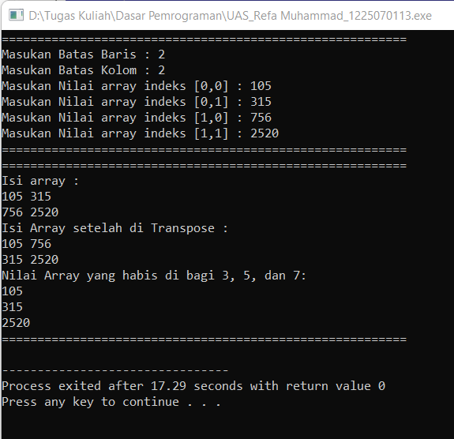

# Ujian Akhir Semester 
 Mata Kuliah 	: Dasar Pemrograman
  Nama		: Refa Muhammad
 NIM		:	1227050113
 Jurusan		:[Teknik Informatika](http://if.uinsgd.ac.id/) [UIN Sunan Gunung Djati Bandung](https://uinsgd.ac.id/) 

## Deskripsi Umum
Aku cinta mata kuliah fisdas 

## Source Code
#include <iostream>

using namespace std;

int main(){
	int m,n, A[100][100], Tp[100][100];
	cout<<"========================================================="<<endl;
	//input batas array
	cout<<"Masukan Batas Baris : ";
	cin>>m;
	cout<<"Masukan Batas Kolom : ";
	cin>>n;
	//input nilai array
	for(int i=0; i<m; i++){
		for(int j=0; j<n; j++){
			cout<<"Masukan Nilai array indeks ["<<i<<","<<j<<"] : ";
			cin>>A[i][j];
		}
	}
	cout<<"========================================================="<<endl;
	cout<<"========================================================="<<endl;
	//output array
	cout<<"Isi array :"<<endl;
	for(int i=0; i<m; i++){
		for(int j=0; j<n; j++){
			cout<<A[i][j]<<" ";
		}
		cout<<endl;
	}
	//array setelah di transpose
	for(int i=0; i<m; i++){
		for(int j=0; j<n; j++){
			Tp[j][i]=A[i][j];
		}
	}
	cout<<"Isi Array setelah di Transpose : "<<endl;
	for(int i=0; i<m; i++){
		for(int j=0; j<n; j++){
			cout<<Tp[i][j]<<" ";
		}
		cout<<endl;
	}
	//nilai array yang habis di bagi 3,5,7
	cout<<"Nilai Array yang habis di bagi 3, 5, dan 7: "<<endl;
	for(int i=0; i<m; i++){
		for(int j=0; j<n; j++){
			if(A[i][j]%3 == 0 && A[i][j]%5 == 0 && A[i][j]%7 ==0 ){
				cout<<A[i][j]<<endl;
		}
		}
	}
	cout<<"========================================================="<<endl;
}
	
## Output

